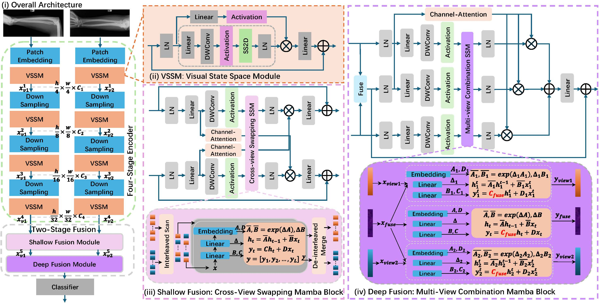

<div align="center">
<h1>XFMamba: Cross-Fusion Mamba for Multi-View Medical Image Classification</h1>
</div>

## Introduction

This repository contains the code for our paper:  
**XFMamba: Cross-Fusion Mamba for Multi-View Medical Image Classification**  
[[Paper on arXiv](https://arxiv.org/abs/2503.02619)] — Accepted at MICCAI 2025.



---

## Environment

1. Create a new environment:
   ```bash
   conda create -n xfmamba python=3.10
   conda activate xfmamba
   ```

2. Install dependencies:
   ```bash
   pip install torch==2.2 torchvision torchaudio triton pytest chardet yacs termcolor fvcore seaborn packaging ninja einops numpy==1.24.4 timm==0.4.12
   ```

3. Install Mamba:
   ```bash
   pip install https://github.com/state-spaces/mamba/releases/download/v2.2.4/mamba_ssm-2.2.4+cu12torch2.2cxx11abiTRUE-cp310-cp310-linux_x86_64.whl
   ```

---

## Datasets

We use the following three publicly available medical imaging datasets:

- [MURA](https://stanfordmlgroup.github.io/competitions/mura/)
- [CheXpert](https://stanfordmlgroup.github.io/competitions/chexpert/)
- [CBIS-DDSM](https://www.cancerimagingarchive.net/collection/cbis-ddsm/)

The dataset CSV:
- [MURA](https://drive.google.com/drive/folders/1FNNxGkxmxBxTFoVi6WIuvKLWoWmALz-9?usp=sharing)
- [CheXpert](https://drive.google.com/drive/folders/1BaDUcjuQXCIbQ7CXIPe11_1so9V2wgYX?usp=sharing)
- [CBIS-DDSM](https://drive.google.com/drive/folders/16RM3VxNpv8mnHRw66Bp7Djqxc4dXkC4J?usp=sharing)

---

## Training and Inference

1. Download the pre-trained VMamba weights and place them in the pretrained/vmamba directory:

   - [VMamba_Tiny](https://drive.google.com/file/d/1YXzScYUW0cwX93kTE9Q0K0IPlzC6NNH6/view?usp=drive_link)
   - [VMamba_Small](https://drive.google.com/file/d/1hCkUfGw-nn6-sXymJf-biqsoh9vU3MIK/view?usp=drive_link)
   - [VMamba_Base](https://drive.google.com/file/d/1QOZsCG9JQsQZkz7tfuNVF2ZT7zEuUv4b/view?usp=drive_link)

2. Train the model:
   ```bash
   python 1_train_model.py \
       --root_dir '.' \
       --dataset 'mura' \
       --model_name 'dualfusionmambav13' \
       --num_tasks 1 \
       --num_classes 2 \
       --confusion_matrix_folder '.' \
       --savemodel_path '.' \
       --train_num 1
   ```

3. Run inference:
   ```bash
   python 2_inference_mura.py \
       --model_name 'dualfusionmambav13' \
       --model_path ''
   ```

---

## Results

`XFMamba` achieves a strong balance between performance and efficiency, offering a lightweight and high-performing solution for multi-view medical image classification.

*FLOPs and AUROC results are based on the [CBIS-DDSM](https://www.cancerimagingarchive.net/collection/cbis-ddsm/) dataset.*


### MURA (2 Classes)

| Architecture | Backbone   | AUROC | Weight Link     |
|--------------|------------|-------|-----------------|
| XFMamba      | VMamba-T   | 89.8% | [XFMamba-T](https://drive.google.com/file/d/1UQObg_tM3w1AGCnptctv0OlwNVJBYmzo/view?usp=drive_link)    |
| XFMamba      | VMamba-S   | 91.0% | [XFMamba-S](https://drive.google.com/file/d/1uxKAXW4KxQKn7sxs60segTFFDtC2sz2J/view?usp=drive_link)    |
| XFMamba      | VMamba-B   | 90.4% | [XFMamba-B](https://drive.google.com/file/d/1Et0Czr-rr4KM5saTAFZEYu2FixmpI-Zw/view?usp=drive_link)    |

### CheXpert (13 Classes)

| Architecture | Backbone   | AUROC | Weight Link     |
|--------------|------------|-------|-----------------|
| XFMamba      | VMamba-T   | 91.7% | [XFMamba-T](https://drive.google.com/file/d/1jsEYQcbxhjTt2E_TUlMpTah7bNdWbToE/view?usp=drive_link)    |
| XFMamba      | VMamba-S   | 91.8% | [XFMamba-S](https://drive.google.com/file/d/1U3asp8gK8T9Rczs4c-b0XsMuvYUcY_eE/view?usp=drive_link)    |
| XFMamba      | VMamba-B   | 91.9% | [XFMamba-B](https://drive.google.com/file/d/1aLHHREXUKICZpoJTrAXaUk5_tO5dl5L7/view?usp=drive_link)    |

### CBIS-DDSM (2 Classes)

| Architecture | Backbone   | AUROC | Weight Link     |
|--------------|------------|-------|-----------------|
| XFMamba      | VMamba-T   | 66.4% | [XFMamba-T]()    |
| XFMamba      | VMamba-S   | 75.2% | [XFMamba-S]()    |
| XFMamba      | VMamba-B   | 76.1% | [XFMamba-B]()    |

---

## Citation

If you find this repository helpful for your research, please consider citing our work:

```bibtex
@inproceedings{zheng2025xfmamba,
  title={Xfmamba: Cross-fusion mamba for multi-view medical image classification},
  author={Zheng, Xiaoyu and Chen, Xu and Gong, Shaogang and Griffin, Xavier and Slabaugh, Greg},
  booktitle={International Conference on Medical Image Computing and Computer-Assisted Intervention},
  pages={672--682},
  year={2025},
  organization={Springer}
}
```