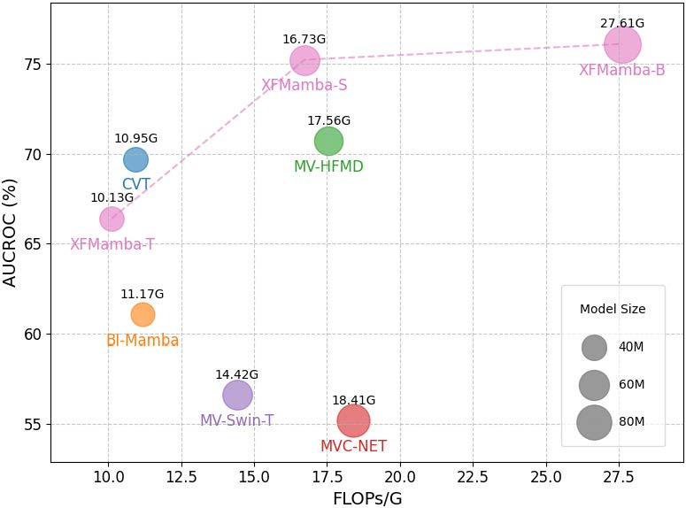

# XFMamba

<div align="center">
<h1>XFMamba: Cross-Fusion Mamba for Multi-View Medical Image Classification</h1>
</div>

## Introduction

This repository contains the code for our paper:  
**XFMamba: Cross-Fusion Mamba for Multi-View Medical Image Classification**  
[[Paper on arXiv](https://arxiv.org/abs/2503.02619)] — Accepted at MICCAI 2025.


---

## Environment

1. Create a new environment:
   ```bash
   conda create -n xfmamba python=3.10
   conda activate xfmamba
   ```

2. Install dependencies:
   ```bash
   pip install torch==2.2 torchvision torchaudio triton pytest chardet yacs termcolor fvcore seaborn packaging ninja einops numpy==1.24.4 timm==0.4.12
   ```

3. Install Mamba:
   ```bash
   pip install https://github.com/state-spaces/mamba/releases/download/v2.2.4/mamba_ssm-2.2.4+cu12torch2.2cxx11abiTRUE-cp310-cp310-linux_x86_64.whl
   ```

---

## Datasets

We use the following three publicly available medical imaging datasets:

- [MURA](https://stanfordmlgroup.github.io/competitions/mura/)
- [CheXpert](https://stanfordmlgroup.github.io/competitions/chexpert/)
- [CBIS-DDSM](https://www.cancerimagingarchive.net/collection/cbis-ddsm/)

---

## Training

1. Download the pretrained VMamba weights:

   - [VMamba_Tiny](https://drive.google.com/file/d/1W0EFQHvX4Cl6krsAwzlR-VKqQxfWEdM8/view?usp=drive_link)
   - [VMamba_Small](https://drive.google.com/file/d/1671QXJ-faiNX4cYUlXxf8kCpAjeA4Oah/view?usp=drive_link)
   - [VMamba_Base](https://drive.google.com/file/d/1qdH-CQxyUFLq6hElxCANz19IoS-_Cm1L/view?usp=drive_link)

2. Train the model:
   ```bash
   python 1_train_model.py \
       --dataset 'mura' \
       --model_name 'dualfusionmambav13' \
       --num_tasks 1 \
       --num_classes 2 \
       --confusion_matrix_folder '.' \
       --savemodel_path '.' \
       --train_num 1
   ```

3. Run inference:
   ```bash
   python 2_inference_mura.py \
       --model_name 'dualfusionmambav13' \
       --model_path ''
   ```

---

## Results

`XFMamba` achieves a strong balance between performance and efficiency, offering a lightweight and high-performing solution for multi-view medical image classification.

*FLOPs and AUROC results are based on the [CBIS-DDSM](https://www.cancerimagingarchive.net/collection/cbis-ddsm/) dataset.*



### MURA (2 Classes)

| Architecture | Backbone   | AUROC | Weight Link     |
|--------------|------------|-------|-----------------|
| XFMamba      | VMamba-T   | 89.8% | [XFMamba-T]()    |
| XFMamba      | VMamba-S   | 91.0% | [XFMamba-S]()    |
| XFMamba      | VMamba-B   | 90.4% | [XFMamba-B]()    |

### CheXpert (13 Classes)

| Architecture | Backbone   | AUROC | Weight Link     |
|--------------|------------|-------|-----------------|
| XFMamba      | VMamba-T   | 91.7% | [XFMamba-T]()    |
| XFMamba      | VMamba-S   | 91.8% | [XFMamba-S]()    |
| XFMamba      | VMamba-B   | 91.9% | [XFMamba-B]()    |

### CBIS-DDSM (2 Classes)

| Architecture | Backbone   | AUROC | Weight Link     |
|--------------|------------|-------|-----------------|
| XFMamba      | VMamba-T   | 66.4% | [XFMamba-T]()    |
| XFMamba      | VMamba-S   | 75.2% | [XFMamba-S]()    |
| XFMamba      | VMamba-B   | 76.1% | [XFMamba-B]()    |

---

## Citation

If you find this repository helpful for your research, please consider citing our work:

```bibtex
@article{zheng2025xfmamba,
  title={XFMamba: Cross-Fusion Mamba for Multi-View Medical Image Classification},
  author={Zheng, Xiaoyu and Chen, Xu and Gong, Shaogang and Griffin, Xavier and Slabaugh, Greg},
  journal={arXiv preprint arXiv:2503.02619},
  year={2025}
}
```